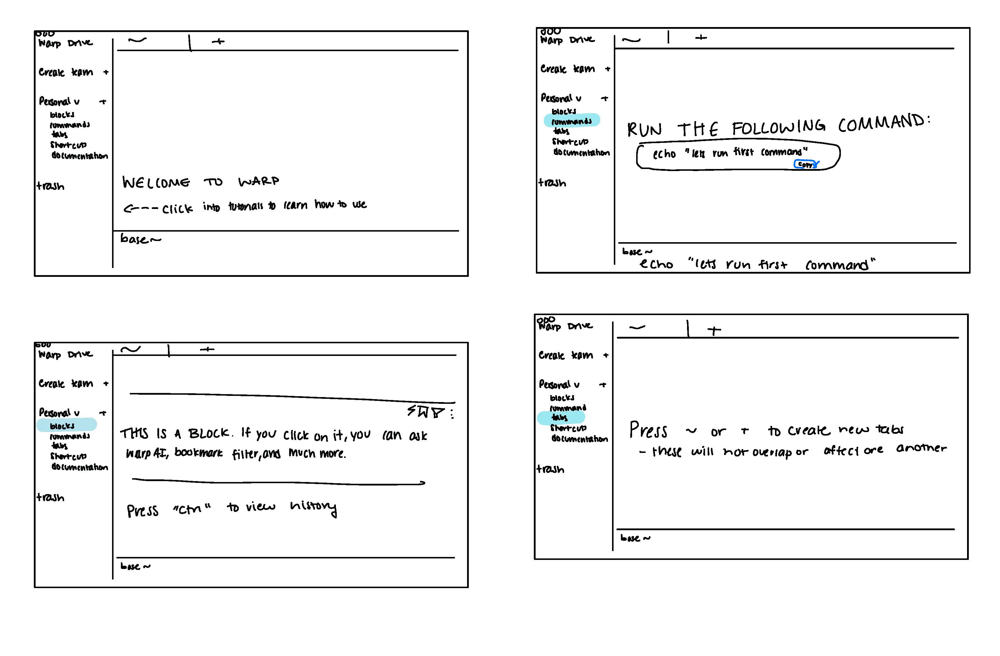
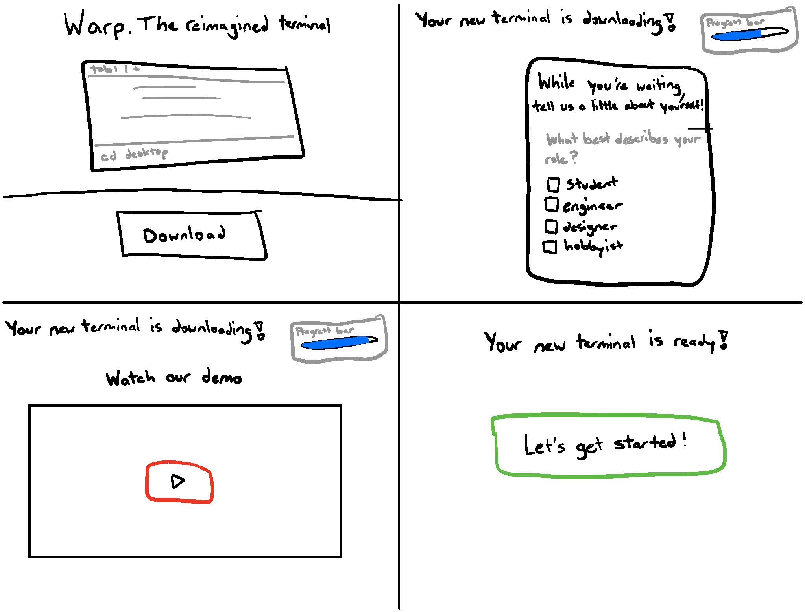
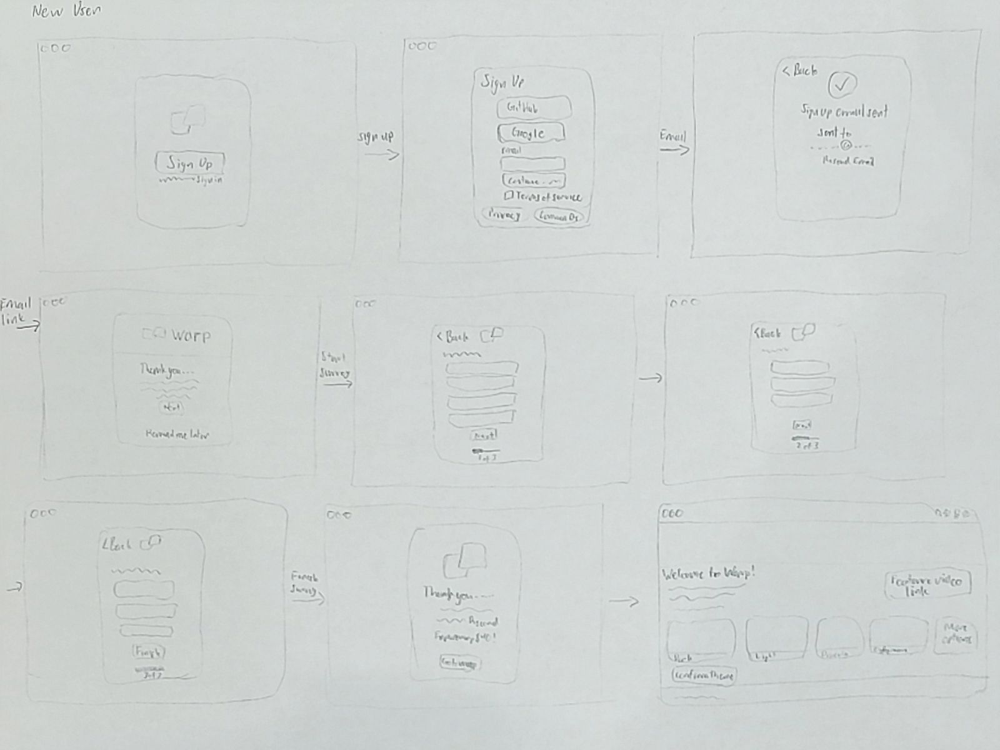
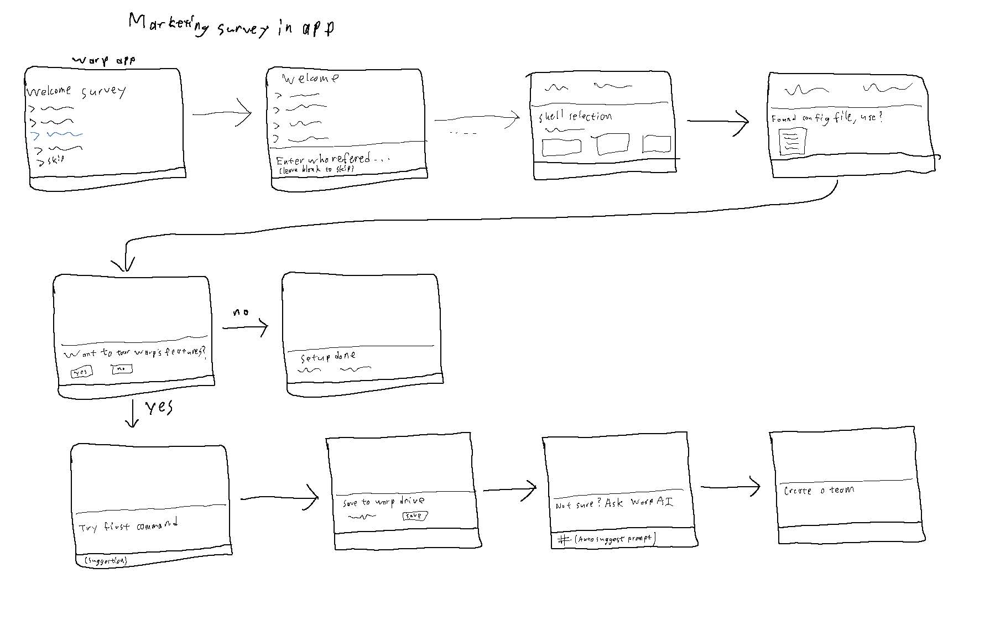

# Iteractive Design

For this project, we partnered with a startup company called Warp to improve their app's onboarding experience for new users. Our team of 4 went through several iterations of the design process in order to produce a final high-fidelity prototype that we then presented back to the Warp design team.

## The Problem

Warp's app is a modernized developer terminal with built-in tools for collaboration and AI. Warp already had an existing onboarding experience for new users. At a high level, this experience consisted of downloading the app, signing up with an email, completing a marketing survey in a modal, then customizing the appearance of the app directly through the terminal interface.

We were tasked with improving and expanding this entire sequence, including finding a way to introduce some of Warp's features to users so they could easily determine if the app was suitable for them. Warp also wanted us to reduce friction so that users could get value out of the app faster and address some confusion that new users experienced.

## Initial Sketches

To generate ideas, each team member sketched 2 different possible flows of an improved onboarding sequence. The full sketches are viewable as pdfs separated by each member avaiable at the following links: [Emily](/iterative-design-handin/sketches/emily-sketches.pdf), [Futen](/iterative-design-handin/sketches/futen-sketches.pdf), [Joel](/iterative-design-handin/sketches/joel-sketches.pdf), and [Mitchell](/iterative-design-handin/sketches/mitchell-sketches.pdf). A few screenshots are included below to capture their essence.

There were quite a few aspects that our sketches differed on. For example, we came up with different ideas of how and where to present the marketing survey - some integrated it into the terminal experience directly and others kept it as a separate modal. We also differed in the medium we would use to introduce users to Warp's features, for example having it as a video walkthrough on the download page vs a more interactive tutorial within the app.

## 1st Lofi Iteration
Lofi 1st-iteration Figma: <https://www.figma.com/file/TACkvKX91Mf63XSs0fzw2F/Warp-Onboarding-Lo-Fi?type=design&node-id=0%3A1&mode=design&t=qLzWIJhAT7564zYE-1>

NEED TO DO THIS!
In your hand in, briefly describe:
the design decisions that led to this final design
what parts you kept from different sketches and why
and how your designs lead to the intended impact you discussed with your group

### Critique

The feedback we received from our peers included suggetsions regarding general formatting of our sketches and specific technical choices for ease of interpretation by the end users. Some suggestions included not having too much whitespace in our initial log-in/sing up screen in order to differentiate between the figma background and the frame background, making sure to include the scrollable history on all screens, and having consistent formatting across all the screens. Some thought the setup part might be confusing, especially for new developers, and suggestions included perhaps having a prompt before starting the technicals. One suggestion was to include some sort of progress indication regarding the length of the marketing survey and perhaps the entire onboarding experience. In addition, the "Other" option in the marketing survey with the included text box below it seemed confusing to some. Some points to consider were how multi-select would work within the clicking process, since a variable amount of options may be desired. Additional suggestions included having screens to introduce/transition between different parts of the first-time user experience (e.g. survey --> onboarding --> walkthrough), changing the name of the marketing survey to "intro survey" instead, and including a side panel that allows for between navigation and skipping through the onboarding experience.

The feedback we received from the client was quite sparse. Our contact suggested thinking about how the donwload flow would fit in to the process, since the first-time user experience is defined from the moment the user clicks "download" to the first 24 hours or even the first week of use. In additon, the suggestion to move the marketing survey into the "blocklist" or terminal view instead of the modal was repeated again.

## 2nd Lofi Iteration

Lofi 2nd-iteration Figma: <https://www.figma.com/file/50TYCr9AH0QHsNiBSxBS9W/Warp-Onboarding-Final?type=design&mode=design&t=Jn5SAC6rQsVRtICP-1>

We made a few noticeable changes to our first lo-fi mockup. The biggest change was to move the marketing survey into the "in-blocklist" terminal experience, as per suggested by our client. The primary reason for this was due to the fact that this suggestion had been repeated multiple times. Although we personally did not agree to the move as the optimal user experience, we felt that the opinion of the client should be prioritized over personal rationale regarding user optimality. We disagreed with incorporating the marketing survey into the in-blocklist terminal onboarding process mainly because we felt the dry rigor of clicking through a user survey offered little benefit to the first-time user, dimished incentive to continue with the onboarding process for Warp, and generally seemed out of place in such a critical time of experimentation for the first-time user. The process of clicking through questions one-at-a-time in the terminal does not seem conducive to providing the user with a broad overview of the features of Warp. It also brought up technical concerns regarding data transfer on the backend; the incorporation of the survey into the terminal allows for the viewing of one's history of survey responses, and the decision of whether to allow the user to change responses brought up considerations of when a user was considered to have completed a question and when the response data should be submitted to Warp. Furthermore, the need to potentially select multiple options within some questions surfaced concerns regarding whether a "finished" button was necessitated for each question. If so, the addition of such input between each question would only added to the tediousness of the process. We forewent the suggestion to change the name of the marketing survey, as that was the term colloquially used by our contact; we felt it was not apt to change a term they most likely already used within the company.

## Visual style guide
Visual Style Guide Figma: <https://www.figma.com/file/50TYCr9AH0QHsNiBSxBS9W/Warp-Onboarding-Final?type=design&node-id=2008%3A1979&mode=design&t=qLzWIJhAT7564zYE-1>

Warp provided a relatively thorough brand manual, though it was targeted more towards their website rather than the terminal application. We attempted to mimic the general style of the Warp terminal, including a few variations of base colors. The primary, background, and text colors all have sufficient contrast, and the base primary color is only used with selectable objects. A darker background can be used to place emphasis on a specific region. The typography matched the recommendations of the Warp brand manual, which were likely chosen due to their easy readability at different font sizes and styles. We also provided buttons with hover and click effects, and the general icons and components used. In places where navigation is less clear, we provide popup messages to direct the user's attention.

## High Fidelity Prototype
Hifi Prototype Figma: <https://www.figma.com/file/50TYCr9AH0QHsNiBSxBS9W/Warp-Onboarding-Final?type=design&node-id=2006%3A5&mode=design&t=qLzWIJhAT7564zYE-1>

We chose to place the marketing survey in the blocklist as this was specifically requested by Warp. We removed the confirm buttons after selecting an option as this would be slightly more efficient and sleek, and users may always go back and change their answers. In the Figma, you may select multiple options, but this is only due to the complex and time-consuming methods for keeping track of state, which we decided to be not a good use of our limited time. In practice, only one option may be selected. We also added a submit button for the survey as technically, there would likely need to be a point at which the user can no longer change their answers and the survey can be sent to the Warp marketing team. This would clear the terminal to transition into the setup portion.

Our setup portion begins similarly to the existing setup guide. Once again, we decided to remove selection confirmation as users may always go back and change their answers. We also added a shell selection section to address one of the pain points mentioned in the project debrief. Certain users were unclear if their existing configurations could be brought over into Warp, so the shell selection part of the setup guide clearly states that their configurations are transferred while also providing the option to use different shells, which Warp does support.

We also added a walkthrough portion to the onboarding experience as we believed this would give users a better sense of what makes Warp unique. We believed this would increase Week 1 retention, the primary metric, as Warp has a lot of powerful features that makes it really useful that not all users may be aware of. In the current version of Warp, most of the features are not especially highlighted or demonstrated, simply existing as unmarked buttons. We prompt the user to input their first command in order to explain Warp blocks and transition into demonstrating how to use the Warp drive. We did notice that simply having text instructions often allowed them to be overlooked, and thus added popup messages to more clearly direct users and generally tried to avoid using long blocks of text where visual indicators could be more effective. We also demonstrated Warp AI both for debugging and command generation. We added an input box border in the Warp AI section as this made it much more clear which region of text users can edit. Finally, we highlighted the Warp Essentials button as this provides numerous tips and updates regarding how to optimize Warp usage.

### Critique

During our meeting with the Warp designers, they shared their interest in our changes to the onboarding experience. They said they had not previously considered including the AI feature in their onboarding educational process but were intrigued by this possibility. They were also drawn to our use of block popups; we provided a new outlook that David had initially never considered to make the information stand out more to a user. We discussed the importance of the marketing survey, but they asked for further clarification on how a user could skip it. We shared the feature we had included to skip this process but decided that, given time for further development, we would need to make changes based on their feedback. They also wanted us to consider the survey following the typical scrollable history of blocklists. As a group, we discussed different ways to submit the survey information in a non-jarring way to receive user feedback while keeping users engaged in the onboarding process. Overall, David and Rob enjoyed our use of end-to-end prototyping and testing but suggested giving more thought to spacing, padding, and text size, given our group had more time for a complete, in-depth design. They appreciated our innovative and unique solutions and shared that we had sparked conversations that would lead to further development and iterations of the product.

## Conclusion

Through this interactive design, we remodeled Warp’s onboarding survey and their education experience. Our group started by creating eight different sketches of the overall onboarding experience. We developed a low-fi design from here and received feedback and critiques from Warp founders on their thoughts and opinions. We took their recommendations to create a second low-fi design and style guide. We then developed a high-fidelity prototype of the sign-up/ login process leading into the marketing survey and the educational onboarding experience. We sent our final product and model to the founders. We received additional feedback on how the design could be further expanded, given a larger team of designers and more time to commit. As a group, we learned the value of collaborating and creating a product based on different opinions. We gained further insight into how to communicate, work, and design for a real company.
